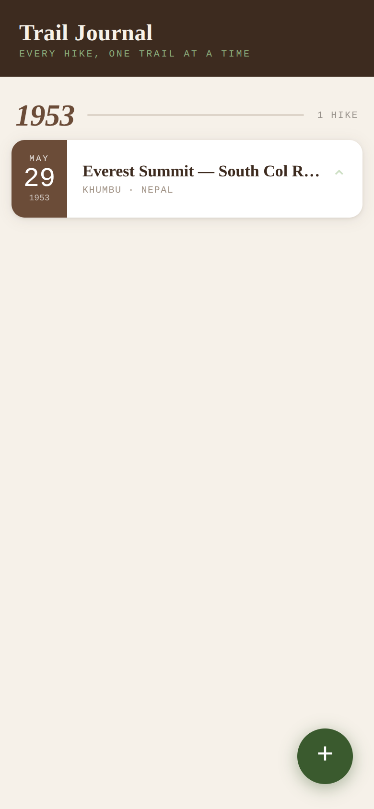
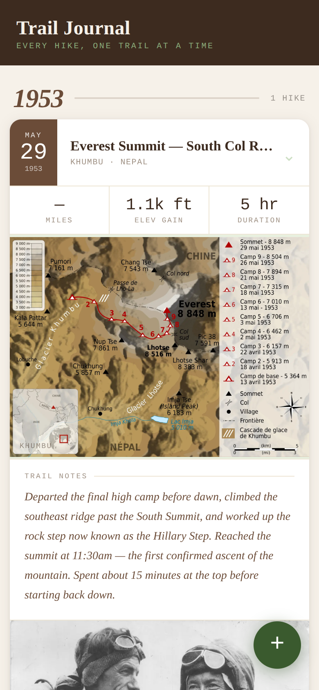
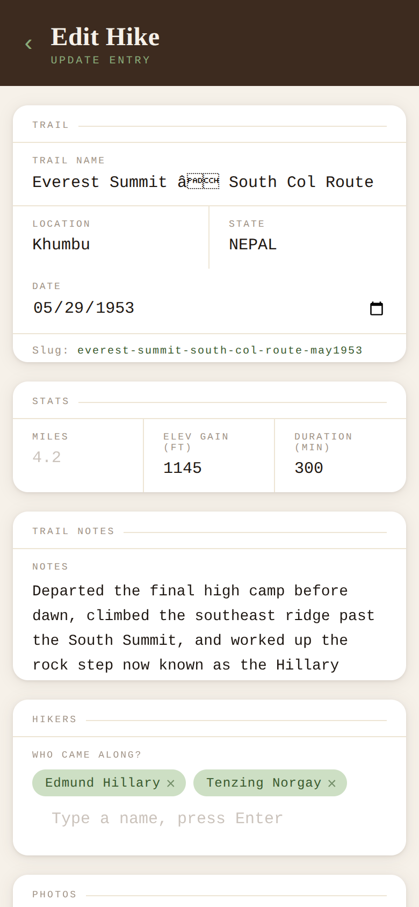

# {{SITE_TITLE}} — Hiking Journal Template

A personal hiking journal template. Phone-first, static, serverless, and free to run. No database, no backend, no build step. The entire site is a handful of HTML files and a single JSON file.

<p float="left">
  
  
  
</p>

*Screenshots use the demo entry shipped in this template — Hillary and Norgay's first ascent of Everest, 29 May 1953.*

---

## How It Works

This is a JAMstack site. The "database" is a single file — `hikes.json` — committed directly to the repository. `index.html` reads it (and every image path) from the same domain the page itself is served from, so it works whether the repo is public or private. `add.html` writes to it using the GitHub REST API, authenticated with a Personal Access Token (PAT) stored in the browser. Cloudflare Pages serves the static files and a custom domain is pointed at it via a CNAME record in Cloudflare DNS.

```
Browser
  ├── reads  hikes.json + images  ← same-origin (served by Cloudflare Pages)
  └── writes hikes.json           ← api.github.com (requires PAT)

Photos
  └── uploaded to staging/ → GitHub Action resizes & converts → assets/images/
```

By default the repo is public, so anyone can view the journal — only someone with the PAT can add, edit, or delete entries. If you want the journal itself locked down too, see [Going Private](#going-private-optional) below — it's a small amount of extra setup, no code changes required.

---

## File Structure

```
hiking-journal/
├── index.html              # The journal — reads and renders hikes.json
├── add.html                # Add or edit a hike — writes to hikes.json
├── hikes.json              # All hike data (the entire data layer)
├── assets/
│   └── images/
│       └── {year}/
│           └── {slug}/     # Processed WebP photos and map images
├── staging/
│   └── .gitkeep            # Receives raw uploads; cleared by the Action
└── .github/
    └── workflows/
        └── process-images.yml
```

---

## The Data File — `hikes.json`

All hike entries live in a single top-level `hikes` array. Each entry follows this schema:

```json
{
  "hikes": [
    {
      "id": "bear-paw-trail-apr2026",
      "trail": "Bear Paw Trail",
      "location": "Valle Crucis",
      "state": "NC",
      "date": "2026-04-09",
      "hikers": ["Alex", "Jamie"],
      "stats": {
        "miles": 2.9,
        "elevation_gain": 1100,
        "duration_minutes": 165
      },
      "notes": "Steep switchbacks up through bare oaks, then a long scramble to the top.",
      "photos": [
        "assets/images/2026/bear-paw-trail-apr2026/01.webp",
        "assets/images/2026/bear-paw-trail-apr2026/02.webp"
      ],
      "map": "assets/images/2026/bear-paw-trail-apr2026/map.webp"
    }
  ]
}
```

The slug format is `{trail-name}-{mon}{year}` — e.g. `bear-paw-trail-apr2026`. It is generated automatically from the trail name and date when creating a new entry and is used as both the record `id` and the image folder name.

All fields except `id`, `trail`, `location`, `state`, and `date` are optional. The journal renders gracefully when stats, photos, notes, or a map are absent.

---

## Pages

### `index.html` — The Journal

Fetches `hikes.json` from the same domain the page is served from — no auth required, and no dependency on the repo being public. Entries are sorted newest-first and grouped by year. Each card accordions open to show stats, a swipeable photo gallery, trail notes, and a map image. The year accent color cycles through a fixed palette keyed to the calendar year, so each year always gets the same color regardless of how many years are in the journal.

A floating `+` button links to `add.html`.

### `add.html` — Log or Edit a Hike

Handles both creating and editing entries. When loaded as `add.html?id={slug}` it pre-populates all fields from `hikes.json` and saves back to the same entry. Without a query parameter it creates a new entry. The "Edit this hike" button on each journal card links directly to the edit URL.

This page requires a PAT to do anything that writes to the repo. On first use a modal prompts for the token and saves it to `localStorage`. It persists across sessions on that device. Any device with the token stored can add or edit entries.

**New entry save flow:** Raw photo files are uploaded to `staging/{slug}/` one at a time, then `hikes.json` is updated with the expected final asset paths. The page then polls `SITE_BASE` (your own domain) waiting for the GitHub Action to produce the processed WebP files. A processing card shows each image popping in as it becomes available. Once all images are confirmed ready it redirects to the journal. This means the journal is never left pointing at files that do not exist yet.

**Edit mode save flow — smart diffing to avoid unnecessary Action runs:**

The edit save distinguishes three cases:

- **Text/stats only changed, no new media selected** — writes the updated `hikes.json` and redirects immediately. No files are staged, no Action is triggered.
- **New photos selected** — the existing photo paths are replaced entirely. New files are staged, `hikes.json` is updated with the new paths, and the processing card waits for the Action.
- **New map only, no new photos** — only the map is re-staged. Existing photo paths are preserved unchanged in `hikes.json`.

In all edit cases the slug is frozen — it always uses the original `id` from the URL parameter, never regenerated from the current form values. This keeps the image folder name stable.

**Delete** removes the entry from `hikes.json` and commits. It does not delete image assets from `assets/images/` — those stay in the repo.

**Photo sort order:** Photos are committed to staging in the order they appear in the file picker. On iOS this is EXIF date/time order, oldest first. The first file becomes `01.webp` and is the hero image shown at the top of the gallery. There is no manual reordering — if you want a specific hero shot, select it first or select photos individually in the desired order.

---

## The Image Pipeline — `process-images.yml`

The GitHub Action triggers on any push that touches the `staging/` folder.

**What it does, step by step:**

1. Checks out the repo with full history (`fetch-depth: 0`)
2. Installs Python 3.12 and Pillow
3. Pulls the latest remote state with `git pull --rebase` before touching anything — this prevents conflicts when `hikes.json` was just written by the browser a few seconds earlier
4. Walks every file in `staging/{slug}/`, resizes it, converts it to WebP, writes it to `assets/images/{year}/{slug}/`, and deletes the original
5. Commits and pushes with `[skip ci]` to avoid triggering itself again

**Why the rebase pull before processing:**
`add.html` commits `hikes.json` and the staging photos in separate API calls. The Action can start before all commits land. Without pulling first, the Action's commit would be based on a stale tree and would either fail or silently overwrite the `hikes.json` update.

**Why the concurrency block:**
If you upload photos in multiple separate bursts — for example selecting from your camera roll in batches — each push triggers its own Action run. The `concurrency` setting ensures only one run proceeds at a time and cancels any queued older run, preventing race conditions on the assets directory.

**Why these image settings — `LONG_EDGE = 2000`, `quality=75`, `method=6`:**
The original settings were 2400px long edge at quality 88. In practice, photos shot on a phone and uploaded through the browser were arriving larger than expected, and with multiple photos per hike the total repo size was growing faster than needed for a journal that displays images at mobile screen widths. 2000px at quality 75 keeps individual processed files comfortably under 1 MB while still looking sharp on any phone screen. Quality 80 and 2500px are a reasonable alternative if storage is less of a concern. `method=6` is the slowest WebP encoder setting — it produces smaller files than the default but takes longer to run. In a CI context that tradeoff is always worth it.

**Why `ImageOps.exif_transpose`:**
Phone cameras store rotation as EXIF metadata rather than actually rotating the pixel data. Without this call, portrait shots uploaded from iOS appear sideways. `exif_transpose` applies the rotation physically and strips the EXIF orientation tag, so images display correctly in any browser regardless of EXIF support. The Action also explicitly strips all other EXIF data (`exif=b""`) and the ICC color profile (`icc_profile=None`) to reduce file size further.

**The map image:**
The map upload in `add.html` commits to `staging/{slug}/map.jpg`. The Action processes it identically to photos and outputs `map.webp`.

---

## Personal Access Token (PAT)

The repo is public, so anyone can read it. But the GitHub API requires authentication to commit changes. A PAT scopes that permission to your account without sharing your password.

**Required scope:** `repo` (full repository access — needed to read and write files via the API).

**Recommended settings:**
- No expiration — the journal is a long-lived personal tool and an expired token just means the form silently fails
- Classic token (not fine-grained) for simplicity
- Store it in your password manager. Paste it into the `add.html` modal on each new device. It is saved to that device's `localStorage` and never needs to be entered again on that device.

The token is never transmitted anywhere except directly to `api.github.com` over HTTPS.

---

## Hosting

The site is hosted on Cloudflare Pages connected to the GitHub repo. Every push to `main` triggers a deploy, though since there is no build step the "deploy" is essentially just Cloudflare pulling the latest files.

A custom domain is configured by adding a CNAME record in Cloudflare DNS pointing the subdomain at the Pages deployment URL. Cloudflare handles the SSL certificate automatically.

---

## Cloning This for Yourself

### 1. Fork or copy the repo

Create your own repo with the same structure. It can be public or private — both work out of the box, since `index.html` reads everything from its own domain rather than depending on the repo being public. See [Going Private](#going-private-optional) if you want the locked-down version.

### 2. Find and replace these values in the code

**`index.html` and `add.html` — near the top of the `<script>` block:**

```js
const GITHUB_USER  = '{{GITHUB_USER}}';   // ← your GitHub username
const GITHUB_REPO  = '{{GITHUB_REPO}}';   // ← your repo name
const GITHUB_BRANCH = 'main';             // leave unless your default branch differs
```

**`add.html` only — the site base URL used for polling processed images:**

```js
const SITE_BASE = '{{SITE_BASE_URL}}'; // ← your custom domain or Pages URL — no trailing slash
```

**`add.html` — page title and header:**

```html
<title>Log a Hike — {{SITE_TITLE}}</title>
```

**`index.html` — journal title and subtitle:**

```html
<h1>{{SITE_TITLE}}</h1>
<div class="sub">{{SITE_SUBTITLE}}</div>
```

These `{{...}}` tokens appear in `index.html` and `add.html` — do a find-and-replace across both files with your own values before deploying.

### 3. Set up the repo structure

This template ships with one demo entry — Hillary and Norgay's first ascent of Everest on 29 May 1953 — so you can see the layout (accordion card, photo gallery, map) working before you add anything of your own. It's a good reference for the `hikes.json` shape.

When you're ready to start your own journal, **replace or remove the demo entry** in `hikes.json`. To start from a blank slate:

```json
{
  "hikes": []
}
```

**Clear the images** — delete `assets/images/1953/everest-summit-may1953/` (or all of `assets/images/`) once you don't need the demo anymore, but leave the `assets/images/` folder itself. The Action will create year and slug subfolders automatically as you add hikes.

**Leave the `.gitkeep` files in place.** Git does not track empty folders, so both `staging/` and `assets/images/` each contain a `.gitkeep` file — a blank file whose only purpose is to keep the folder committed. If you accidentally delete them, recreate them by creating a new empty file named `.gitkeep` inside each folder. Do not delete the `.github/workflows/` folder or its contents.

### 4. Create your PAT

GitHub → Settings → Developer Settings → Personal Access Tokens → Tokens (classic) → Generate new token. Grant the `repo` scope. Copy it and store it in your password manager. You will paste it into the site's token modal on first use from each device.

### 5. Connect Cloudflare Pages

In the Cloudflare Pages dashboard, create a new project connected to your GitHub repo. No build command, no build output directory — set the root as the deploy directory. Add your custom domain and point a CNAME record at the Pages URL in your DNS settings.

### 6. Test the Action

Upload a photo through `add.html` and confirm the Action runs successfully in the GitHub Actions tab. Check that the processed WebP appears in `assets/images/` and the original is gone from `staging/`.

---

## What You Might Want to Add

- **Manual photo reordering** in `add.html` — drag-and-drop on the staged photo list before upload, so you can choose the hero shot explicitly rather than relying on file picker order
- **A `manifest.json`** to complete the PWA setup if you want the saved home screen icon to behave as a full standalone app
- **Pagination or a search bar** on `index.html` once the journal grows large enough that scrolling becomes unwieldy

---

## Going Private (optional)

By default this template is public — anyone can view the journal, and only someone with the PAT can add or edit entries. If you'd rather the whole thing be invite-only, here's the proven setup. **No code changes needed** — `index.html` already reads everything relative to its own domain, so this is entirely a config change on GitHub and Cloudflare.

1. **Make the repo private** on GitHub (Settings → General → Danger Zone). Writes still go through `api.github.com` with your PAT, which works identically on a private repo — nothing changes there.
2. **Set up a Cloudflare Access application** on your custom domain: Cloudflare dashboard → Zero Trust → Access → Applications → Add an application, pointed at your custom domain. Allow-list the specific emails who should have access; they'll get a one-time PIN by email to log in.
3. **Also gate the `*.pages.dev` URL.** Every Cloudflare Pages project gets a free `your-project.pages.dev` subdomain in addition to your custom domain — and it's easy to forget that Access only protects what you've explicitly pointed it at. Add a second Access application (or extend the first) covering the `.pages.dev` domain too, or that URL is an open back door around the whole setup.
4. **Test it:** an allow-listed email gets in via OTP; a random email is blocked; the journal loads and renders; adding/editing a hike still works.

Note: there's no added latency from any of this. The short delay after saving a new hike (waiting for a Cloudflare Pages redeploy before it's visible) already exists in the default setup above — it's a consequence of reading everything same-origin instead of from the public raw CDN, not something Access introduces. Going private and adding Access costs you nothing extra in speed; it only adds a login step.

### If you want zero delay and the PAT out of the browser entirely

There's a further step beyond Access: a Cloudflare Worker that holds the PAT as a server-side secret and proxies every read and write, so the browser never sees the token and there's no redeploy wait either. It's a real piece of infrastructure though — worth being clear-eyed about what it costs versus what it buys:

| | Default (current) | + Cloudflare Worker |
|---|---|---|
| Setup | Already done — nothing extra | Write and deploy a Worker (`wrangler`), rewrite both HTML files' fetch/save logic, manage a Worker secret |
| PAT location | Browser (password manager) | Never leaves the server |
| Latency after saving a hike | Short Pages redeploy delay | Instant |
| Ongoing maintenance | None | A small service to keep working across Worker/Wrangler updates |

For most personal journals, the current setup covers the actual threat model (repo private if you want it, domain gated, PAT scoped to one repo and never public) — the Worker mainly buys convenience, not meaningfully more security. It's a reasonable next step only if the redeploy delay genuinely bothers you in daily use.

